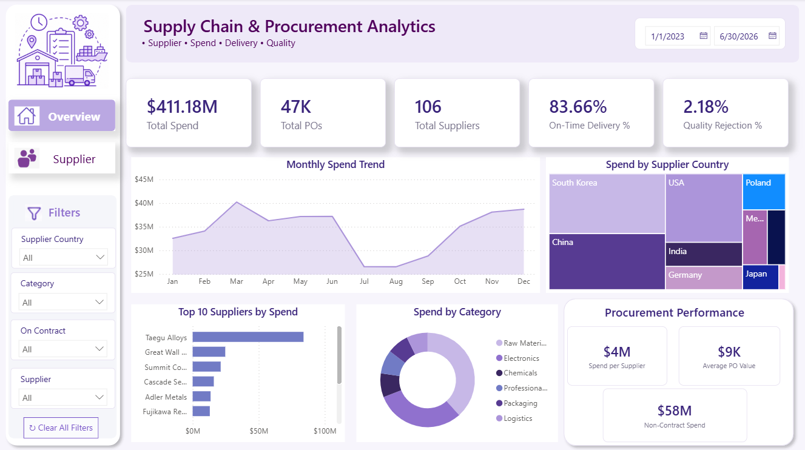
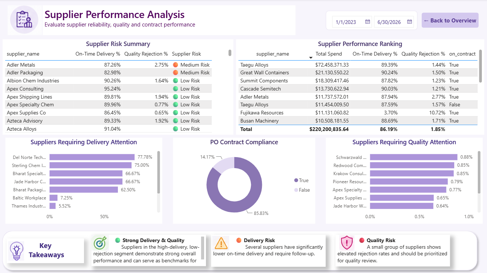

# Supply Chain & Procurement Analytics Dashboard

A Power BI dashboard designed to analyze procurement spend, supplier performance, delivery reliability, quality, and contract compliance.

## Dashboard Overview

This project contains two interactive Power BI report pages:

### 1. Overview

Provides a high-level view of procurement performance, including:

- Total procurement spend
- Total purchase orders
- Total suppliers
- On-time delivery performance
- Quality rejection rate
- Monthly spend trend
- Spend by supplier country
- Top suppliers by spend
- Spend by category
- Procurement performance metrics
- Interactive supplier and category filters



---

### 2. Supplier Performance Analysis

Provides deeper supplier-level analysis, including:

- Supplier risk summary
- Supplier performance ranking
- Suppliers requiring delivery attention
- Suppliers requiring quality attention
- Purchase order contract compliance
- Key procurement takeaways



---

## Key Metrics

| Metric | Description |
|---|---|
| Total Spend | Total procurement spend |
| Total POs | Total purchase orders |
| Total Suppliers | Number of suppliers |
| On-Time Delivery % | Percentage of orders delivered on time |
| Quality Rejection % | Percentage of rejected orders |
| Average PO Value | Average value per purchase order |
| Contract Compliance | Percentage of POs placed on contract |

## Tools & Technologies

- Power BI Desktop
- DAX
- Power Query
- Git & GitHub

## Data

The dashboard was developed using purchase order data containing procurement, supplier, delivery, quality, category, and contract-related information.

Raw data is excluded from this repository using `.gitignore`.

## Dashboard Features

- Interactive date filtering
- Supplier filtering
- Category filtering
- Contract status filtering
- Cross-visual interactions
- Supplier risk classification
- Top and bottom supplier analysis
- Drill-through navigation between report pages

## Project Structure

```text
SupplyChainDashboard/
│
├── SupplyChainDashboard.pbix
├── README.md
├── .gitignore
└── screenshots/
    ├── overview.png
    └── supplier-performance.png